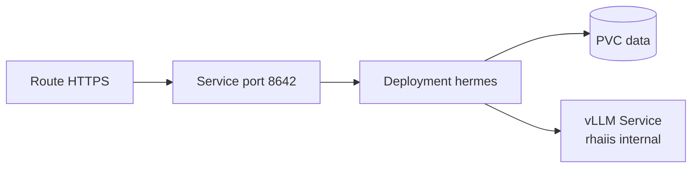



## Introduction

In this post, I want to describe how to deploy *Hermes Agent* on OpenShift and wire it to a self-hosted model endpoint running on the same cluster. This is a direct continuation of two earlier posts: [Deploying OpenShift on AWS](), which covers getting a cluster into place, and the post on running the [Red Hat AI Inference Server on OpenShift](), which covers the model serving layer that Hermes will talk to.

If you want background on what Hermes Agent is and why it is worth running, the companion post [Hermes Agent: A Personal AI That Gets More Useful Over Time]() covers that in more detail. This post focuses on the mechanics of getting it running on OpenShift.

## Architecture

The setup connects two namespaces on the same cluster. The *Red Hat AI Inference Server (RHAIIS)* runs in the `rhaiis` namespace and serves a model on port 8000. Hermes Agent runs in a separate `hermes` namespace and talks to the vLLM server over the internal cluster service network, using the DNS name `rhaiis-vllm.rhaiis.svc.cluster.local:8000`. No public route is involved in that hop.

*OpenRouter* is wired as an automatic fallback. If the vLLM server is unavailable or returns an error, Hermes falls back to a remote model through OpenRouter without requiring any manual intervention.

Externally, Hermes exposes an OpenAI-compatible API on port 8642, secured with a bearer token. An OpenShift Route with TLS termination handles the public endpoint.



## Prerequisites

1. The RHAIIS deployment from [the previous post]() must be running in the `rhaiis` namespace with a deployment named `rhaiis-vllm`. Retrieve the API key that was stored as a secret:

```bash
oc get secret rhaiis-api-key -n rhaiis \
  -o jsonpath='{.data.VLLM_API_KEY}' | base64 -d
```

2. An [OpenRouter](https://openrouter.ai/keys) API key for the fallback model.
3. [OpenShift CLI (oc)](https://docs.redhat.com/en/documentation/openshift_container_platform/4.18/html/cli_tools/openshift-cli-oc#cli-getting-started) authenticated to the cluster with cluster-admin rights.

## Deploying Hermes Agent

All deployment files are available in the [smichard/agent_on_ocp](https://github.com/smichard/agent_on_ocp) GitHub repository. The steps below apply them in sequence.

1. Clone the repository:

```bash
git clone https://github.com/smichard/agent_on_ocp.git
cd hermes_on_ocp
```

2. Create the Namespace and ServiceAccount

```bash
oc new-project hermes
```

Hermes Agent runs as UID 10000. The default restricted SCC in OpenShift does not allow this, so the deployment needs a dedicated ServiceAccount with the `anyuid` SCC:

```bash
oc create serviceaccount hermes -n hermes

oc adm policy add-scc-to-user anyuid \
  -z hermes \
  -n hermes
```

3. Create Secrets

Three secrets are needed: one for the vLLM bearer token, one for the OpenRouter fallback key, and one for the Hermes API server key that clients must present.

**vLLM bearer token:**

Hermes reads the `OPENAI_API_KEY` environment variable for custom OpenAI-compatible endpoints. The vLLM API key from the `rhaiis` namespace is passed in under that name:

```bash
oc create secret generic hermes-vllm-secret \
  --from-literal=OPENAI_API_KEY=<VLLM_API_KEY value> \
  -n hermes
```

**OpenRouter fallback key:**

```bash
oc create secret generic hermes-openrouter-secret \
  --from-literal=OPENROUTER_API_KEY=<your_openrouter_key> \
  -n hermes
```

**Hermes API server key:**

Clients calling the Hermes API must include this key as a bearer token. Generate a random value at creation time:

```bash
oc create secret generic hermes-api-secret \
  --from-literal=API_SERVER_KEY=$(openssl rand -hex 32) \
  -n hermes
```

Retrieve it later with:

```bash
oc get secret hermes-api-secret -n hermes \
  -o jsonpath='{.data.API_SERVER_KEY}' | base64 -d
```

4. Create the ConfigMap

The ConfigMap holds the Hermes Agent configuration file. It sets the primary model provider to the internal vLLM service and configures OpenRouter as the fallback:

```yaml
apiVersion: v1
kind: ConfigMap
metadata:
  name: hermes-config
  namespace: hermes
data:
  config.yaml: |
    model:
      provider: openai_compatible
      base_url: http://rhaiis-vllm.rhaiis.svc.cluster.local:8000/v1
      default: Qwen/Qwen2.5-1.5B-Instruct
    fallback_model:
      provider: openrouter
      model: qwen/qwen-2.5-72b-instruct
    api_server:
      port: 8642
```

Adjust `model.default` to match the `--served-model-name` value used in the RHAIIS deployment. Adjust `fallback_model.model` to any model available on OpenRouter.

```bash
oc apply -f configmap.yaml
```

5. Create a PersistentVolumeClaim

Hermes stores sessions, memories, and workspace data on a persistent volume:

```yaml
apiVersion: v1
kind: PersistentVolumeClaim
metadata:
  name: hermes-data
  namespace: hermes
spec:
  accessModes:
    - ReadWriteOnce
  resources:
    requests:
      storage: 10Gi
```

Apply the file to create the PVC:
```bash
oc apply -f pvc.yaml
```

6. Deploy Hermes Agent

The Deployment mounts the ConfigMap and the PVC, injects the three secrets as environment variables, and runs the container as the `hermes` ServiceAccount. Check the [Hermes Agent repository](https://github.com/NousResearch/hermes-agent) for the current container image reference before applying:

```yaml
apiVersion: apps/v1
kind: Deployment
metadata:
  name: hermes
  namespace: hermes
  labels:
    app: hermes
spec:
  replicas: 1
  selector:
    matchLabels:
      app: hermes
  template:
    metadata:
      labels:
        app: hermes
    spec:
      serviceAccountName: hermes
      volumes:
        - name: hermes-data
          persistentVolumeClaim:
            claimName: hermes-data
        - name: hermes-config
          configMap:
            name: hermes-config
      containers:
        - name: hermes
          image: nousresearch/hermes-agent:v2026.4.23
          imagePullPolicy: Always
          ports:
            - containerPort: 8642
          env:
            - name: OPENAI_API_KEY
              valueFrom:
                secretKeyRef:
                  name: hermes-vllm-secret
                  key: OPENAI_API_KEY
            - name: OPENROUTER_API_KEY
              valueFrom:
                secretKeyRef:
                  name: hermes-openrouter-secret
                  key: OPENROUTER_API_KEY
            - name: API_SERVER_KEY
              valueFrom:
                secretKeyRef:
                  name: hermes-api-secret
                  key: API_SERVER_KEY
          volumeMounts:
            - name: hermes-data
              mountPath: /home/hermes/.hermes
            - name: hermes-config
              mountPath: /home/hermes/.hermes/config.yaml
              subPath: config.yaml
          resources:
            requests:
              cpu: "500m"
              memory: "512Mi"
            limits:
              cpu: "2"
              memory: "2Gi"
```

Apply the file to create the deployment:
```bash
oc apply -f deployment.yaml
```

7. Create a Service and Route

Create a Service that maps port 8642 to port 8642 on the pod:
```yaml
apiVersion: v1
kind: Service
metadata:
  name: hermes
  namespace: hermes
spec:
  selector:
    app: hermes
  ports:
    - protocol: TCP
      port: 8642
      targetPort: 8642
```

Create a TLS-terminated Route to expose the endpoint outside the cluster (optional):
```yaml
apiVersion: route.openshift.io/v1
kind: Route
metadata:
  name: hermes
  namespace: hermes
spec:
  to:
    kind: Service
    name: hermes
  port:
    targetPort: 8642
  tls:
    termination: edge
    insecureEdgeTerminationPolicy: Redirect
```

Apply both and retrieve the assigned hostname:
```bash
oc apply -f service.yaml
oc apply -f route.yaml
oc get route hermes -n hermes -o jsonpath='{.spec.host}'
```

Monitor startup until the pod reaches `Running`:

```bash
oc get pods -n hermes -l app=hermes -w
oc logs -f deployment/hermes -n hermes
```

The API server is ready when the logs show:

```
[api_server] Listening on 0.0.0.0:8642
```

## Testing the Endpoint

Store the hostname and API key in shell variables to keep the commands readable:

```bash
export HERMES_HOST=$(oc get route hermes -n hermes \
  -o jsonpath='{.spec.host}')
export HERMES_KEY=$(oc get secret hermes-api-secret -n hermes \
  -o jsonpath='{.data.API_SERVER_KEY}' | base64 -d)
```

**List available models:**

```bash
curl -sS \
  "https://${HERMES_HOST}/v1/models" \
  -H "Authorization: Bearer ${HERMES_KEY}" | jq -r '.data[].id'
```

**Send a chat completion request:**

```bash
curl -sS \
  "https://${HERMES_HOST}/v1/chat/completions" \
  -H "Authorization: Bearer ${HERMES_KEY}" \
  -H "Content-Type: application/json" \
  -d '{
    "model": "Qwen2.5-1.5B-Instruct",
    "messages": [{"role": "user", "content": "Hello, what can you do?"}]
  }' | jq -r '.choices[0].message.content'
```

A successful response confirms that Hermes is running, the API key is working, and the request reached the vLLM server over the internal cluster network.

To verify the fallback path, scale down the RHAIIS deployment temporarily and send the same request. Hermes should return a response via OpenRouter instead:

```bash
oc scale deployment rhaiis-vllm -n rhaiis --replicas=0
# send a request, observe fallback in hermes logs
oc scale deployment rhaiis-vllm -n rhaiis --replicas=1
```

## Changing the Model

Update `configmap.yaml` and set `model.default` to any model name served by the vLLM instance. The value must match the `--served-model-name` argument used in the RHAIIS deployment. Apply the updated ConfigMap and restart the Hermes deployment to pick up the change:

```bash
oc apply -f configmap.yaml
oc rollout restart deployment/hermes -n hermes
```

## Conclusion

This setup places Hermes Agent inside the same OpenShift cluster as the inference server and routes all model traffic over the internal service network. The public Hermes API endpoint is secured with a separate bearer token, so the vLLM key never leaves the cluster. OpenRouter handles the fallback case without any changes to the application code. The result is a self-hosted agent that uses a self-hosted model for most requests and degrades gracefully when the local server is unavailable.

## References

- GitHub repository with eployment files - [link](https://github.com/smichard/agent_on_ocp)
- Deploying OpenShift on AWS with Automated Cluster Provisioning - [link]()
- Running the Red Hat AI Inference Server on OpenShift - [link]()
- Hermes Agent: A Personal AI That Gets More Useful Over Time - [link]()
- OpenRouter - [link](https://openrouter.ai/)
- OpenShift CLI (oc) - [link](https://docs.redhat.com/en/documentation/openshift_container_platform/4.18/html/cli_tools/openshift-cli-oc#cli-getting-started)
- smichard/agent_on_ocp - GitHub repository - [link](https://github.com/smichard/agent_on_ocp)
- Hermes Agent - GitHub repository - [link](https://github.com/NousResearch/hermes-agent)
- Hermes Agent - Documentation - [link](https://hermes-agent.nousresearch.com/docs/)
- Nous Research - [link](https://nousresearch.com/)
